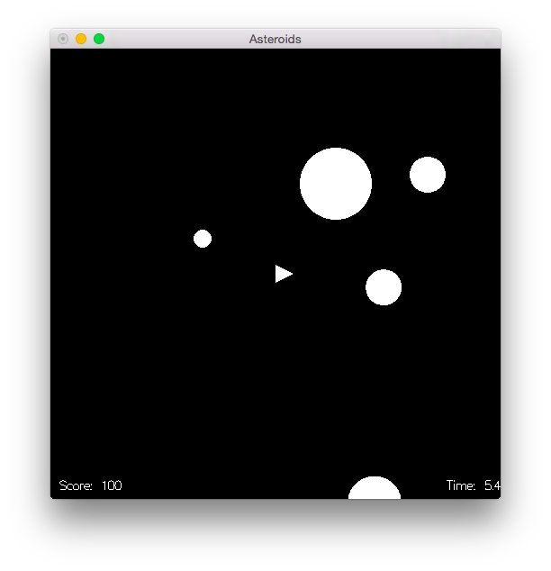

# asteroids

[](https://travis-ci.org/cmc-haskell-2015/asteroids)

Игра «Астероиды».



## Интерфейс и управление

Управление:
- `W` — вперед,
- `A` — поворот против часовой,
- `D` — поворот по часовой,
- `пробел` — стрельба.

Астероиды убивают при соприкосновении и разбиваются на более мелкие при попадании пули.

Зеленые квадраты — бомбы, при нажатии `Х` уничтожаются все астероиды на экране.

Периодически наведывается неопознанный летающий объект, стреляющий лазерами (смертельными) и умирающий через несколько успешных попаданий в него.

## Установка и запуск

Для установки клонируйте репозиторий и запустите `cabal install`:

```
$ git clone https://github.com/cmc-haskell-2015/asteroids.git
$ cd asteroids
$ cabal install
```

После установки запуск осуществляется командой `asteroids`:

```
$ asteroids
```

Для сборки и запуска текущей версии непосредственно из репозитория используйте `cabal run`:

```
$ cd asteroids
$ cabal run
```

## Документация

Автоматическая документация кода сгенерирована при помощи [Haddock](https://www.haskell.org/haddock/).

Онлайн документация доступна здесь: http://cmc-haskell-2015.github.io/asteroids/docs/

Локально документацию можно собрать, запустив простую команду:

```
$ cabal haddock
```

